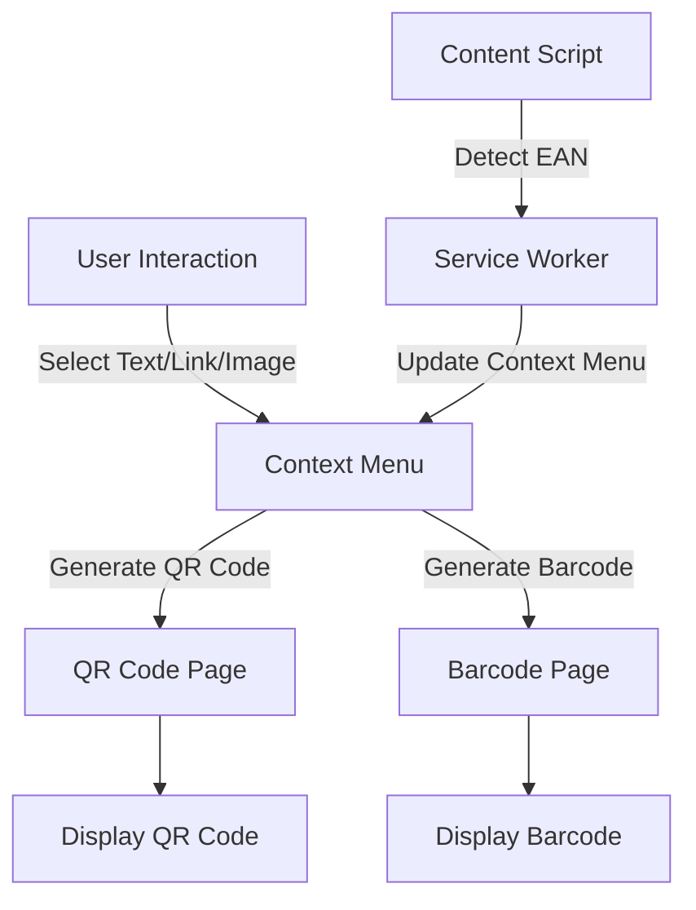
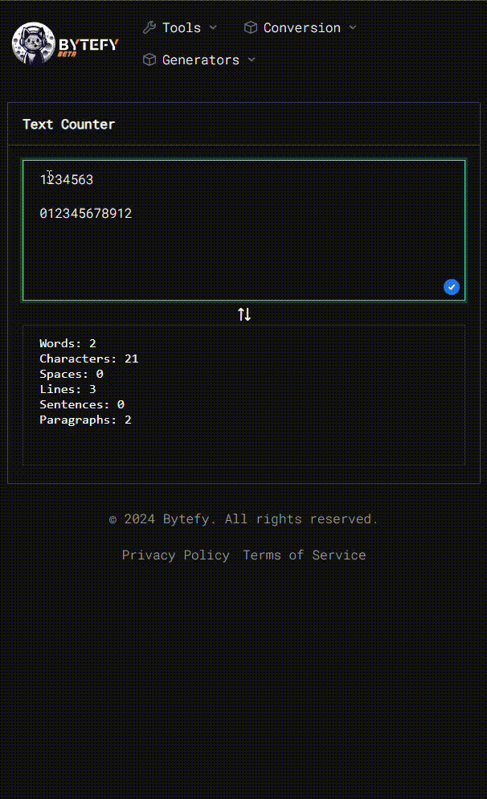
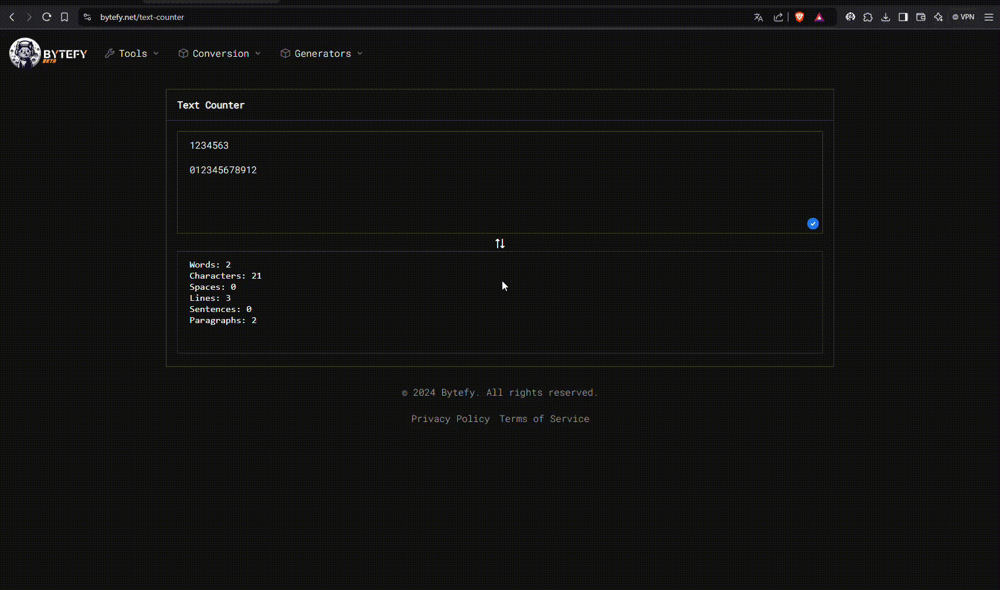

# QR and Barcode Generator Chrome Extension

## Overview

This Chrome extension allows users to generate QR codes and barcodes (EAN-13 and EAN-8) from selected text, links, or images. The extension provides context menu options for generating these codes and displays them in a new tab.

## Features

- Generate QR codes from selected text, links, or images.
- Generate EAN-13 and EAN-8 barcodes from selected text.
- Context menu options dynamically enable or disable based on the selected text.

## Architecture

## Components

### Service Worker (`service_worker.js`)

- **Context Menu Creation**: Creates context menu items for generating QR codes and barcodes.
- **Message Listener**: Listens for messages to update the context menu based on the selected text.
- **Context Menu Click Handler**: Handles clicks on context menu items and opens the appropriate page to display the generated code.

### Content Script (`detect_ean_from_selection.js`)

- **Selection Change Listener**: Detects changes in the selected text and checks if it matches the EAN-13 or EAN-8 format.
- **Message Sender**: Sends messages to the service worker to update the context menu based on the selected text.

### Popup Script (`popup.js`)

- **Generate QR Code**: Generates a QR code for the current tab's URL and displays it in the popup.

### QR Code Page Script (`qr.js`)

- **Generate QR Code**: Generates and displays a QR code based on the content passed in the URL parameters.

### Barcode Page Script (`barcode.js`)

- **Generate Barcode**: Generates and displays a barcode (EAN-13 or EAN-8) based on the content and type passed in the URL parameters.

## Installation
1. Installation
2. Clone the repository.
3. Load the extension in Chrome by navigating to edge://extensions/, brave://extensions/ or chrome://extensions/ and enabling "Developer mode".
4. Click "Load unpacked" and select the extension directory.

## Usage

1. **Install the Extension**: Load the extension in Chrome.
2. **Select Text/Link/Image**: Right-click on the selected text, link, or image.
3. **Generate Code**: Choose the appropriate context menu option to generate a QR code or barcode.
4. **View Code**: A new tab will open displaying the generated QR code or barcode.

## Dependencies

- **QRCode.js**: Library for generating QR codes.
- **JsBarcode**: Library for generating barcodes.

# How it works:

